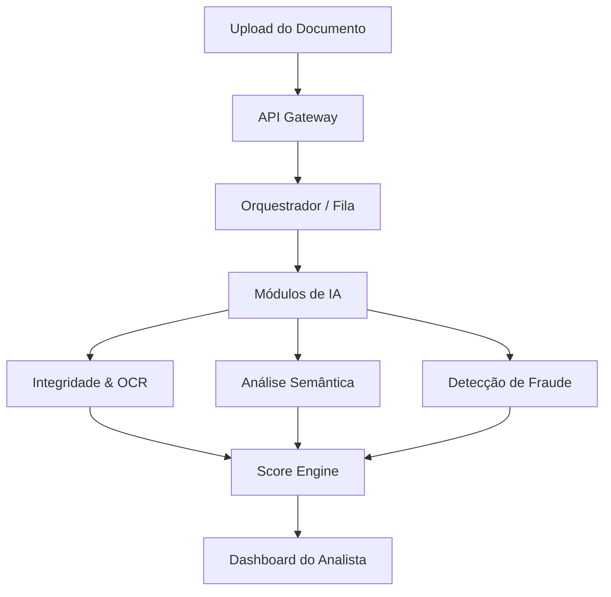

# 🤖 Agente Inteligente de Análise Documental (AIAD)
 

 
Solução automatizada para análise, validação e detecção de anomalias em contratos e documentos (PDF, Imagens, DOCX). O sistema foca em reduzir o esforço manual e mitigar riscos operacionais e de fraude.
 
## 📌 Objetivo
Transformar o processo de triagem para times de **Jurídico, Compliance e Security**, atacando:
* **Alto custo operacional:** Automatização de análises repetitivas.
* **Risco de erro humano:** Identificação precisa de dados conflitantes.
* **Fraudes e Inconsistências:** Detecção de adulterações e cláusulas abusivas.
 
---
 
## 🚀 Proposta do MVP
 
### Escopo e Funcionalidades
* **Entradas:** PDFs, DOCX e Imagens (Contratos, aditivos, documentos KYC).
* **Saídas:** * **Score de Risco (0–100):** Classificação em Baixo, Médio ou Alto.
  * **Relatório de Achados:** Evidências de inconsistências ou fraudes.
  * **Sugestões de Ação:** Recomendações baseadas em conformidade.
 
---
 
## 🏗️ Arquitetura Proposta

### Fluxo de Dados (Diagrama)

---

 ## Detalhes dos Módulos
 
- **NLP/LLM:** Utiliza spaCy (NER) para extração de entidades e SBERT para similaridade de cláusulas. LLMs são usados para sumarização explicável.
- **Detecção de Anomalias:** Algoritmos como Isolation Forest analisam características técnicas do documento.
- **Segurança:** Varredura com ClamAV e sanitização de scripts embutidos em arquivos.
 
---
 
## 🛠️ Tecnologias Utilizadas
 
| Camada           | Tecnologia                              |
|------------------|-----------------------------------------|
| Linguagens       | Python, Node.js                         |
| IA / NLP         | spaCy, Sentence-BERT, LLMs (GPT/Llama)  |
| Visão / OCR      | Tesseract, Azure OCR, PyMuPDF           |
| Machine Learning | Scikit-learn (Isolation Forest)         |
| Segurança        | ICP-Brasil (X.509), ClamAV, Vault       |
| Infra            | Docker, S3, Vector DB (Pinecone/Milvus) |
 
---
 
## 🔄 Fluxo do Sistema
 
1. **Envio:** O usuário realiza o upload via Frontend.
2. **Processamento:** O sistema executa OCR e extração de metadados.
3. **Análise:** Módulos de IA verificam inconsistências semânticas e técnicas.
4. **Regras:** O motor de regras valida dados cadastrais (ex: CNPJ ativo).
5. **Resultado:** O sistema gera um score e alerta o analista humano em caso de criticidade.
 
> [!NOTE]
> **Limitações do MVP:** Não inclui biometria manuscrita ou integração direta com base de dados de cartórios.
